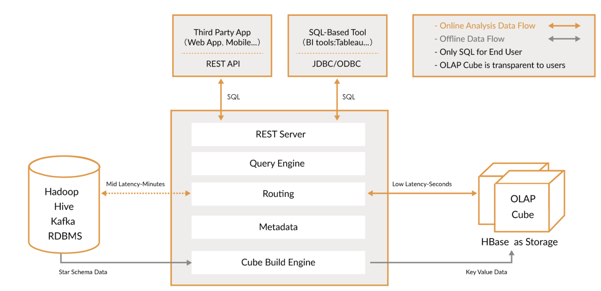

# Kylin

## 简介
>Extreme OLAP Engine for Big Data  
Apache Kylin™是一个开源的分布式分析引擎，提供Hadoop之上的SQL查询接口及多维分析（OLAP）能力以支持超大规模数据

## 架构原理

### 原理
- 基于Cube的预计算
- 空间换时间（用预计算的时间换在线查询的时间）

## 环境搭建

### 下载安装包并解压

- 安装包地址：https://archive.apache.org/dist/kylin/apache-kylin-2.0.0/apache-kylin-2.0.0-bin-cdh57.tar.gz

- 启动：kylin.sh start

## 实战

 **交易模型：** 最简单的星型模型（一个事实表，3个维度表）
 - 交易事实表，包括交易详细信息，例如哪个客户（客户号，账号，子账号，哪个支行开的账户）什么时候（交易时间）在哪里（哪个行）交易（转账、消费、还款等）了多少钱（金额，即事实）
 - 账户维度表，描述账户的详细信息
 - 机构维度表，
 - 日期维度